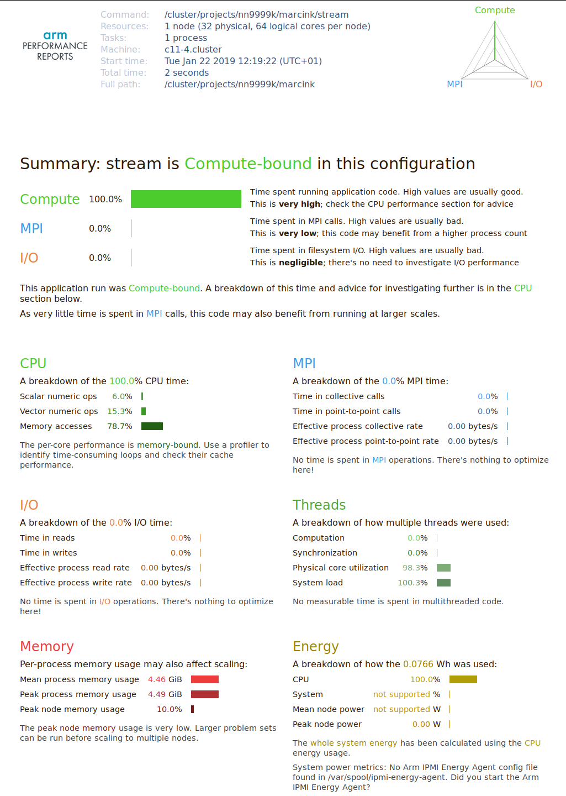
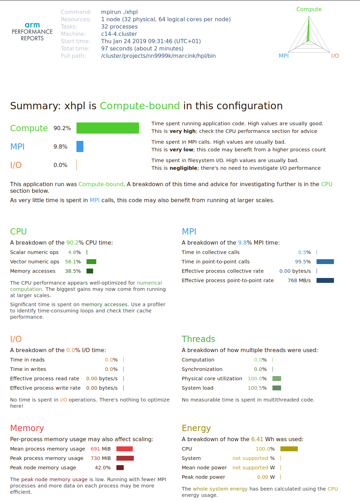
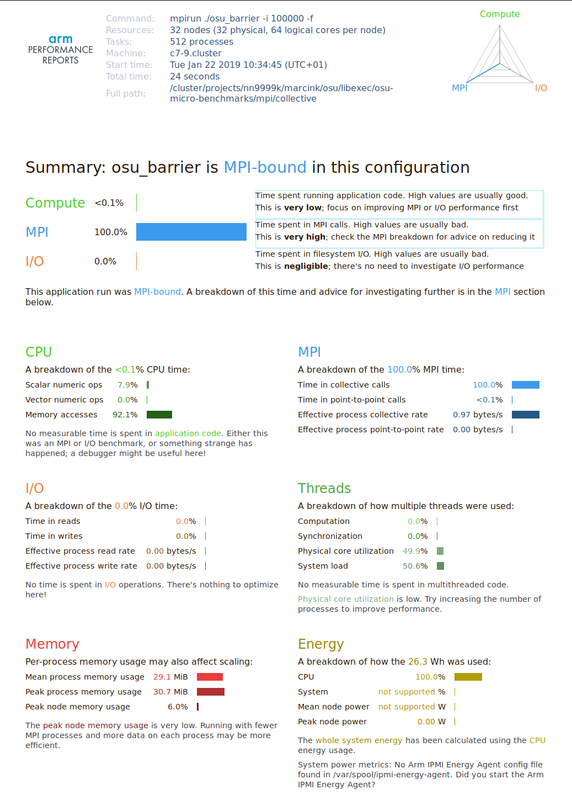
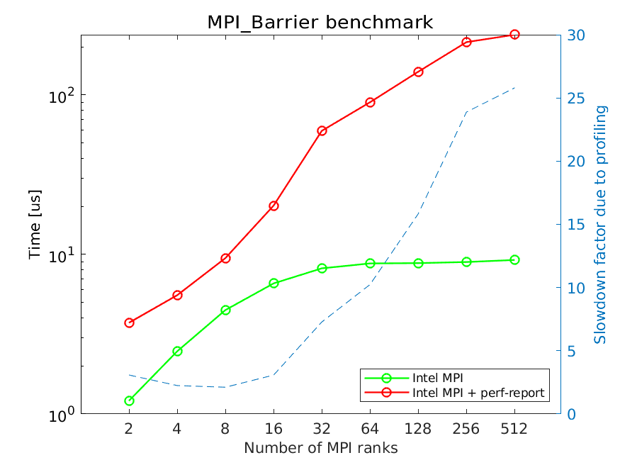
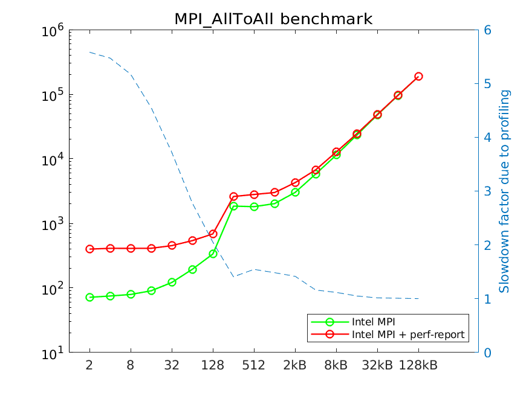

# ARM Performance Reports

[ARM Performance
Reports](https://developer.arm.com/docs/101137/latest/contents) is a
performance evaluation tool. It is very simple to use, produces a
clear, single-file report, and it is used to obtain a
high-level overview of the performance characteristics. It provides
similar information as the Summary tab in the more complex [VTune
package](vtune.md), but in a lighter form. Amongst others, it can
report CPU time spent on various types of instructions (e.g.,
floating-point), communication time (MPI), multi-threading level and
thread synchronization overheads, memory bandwidth, and IO performance.
Such a report can help spotting certain bottlenecks in the
code and highlight potential optimization directions, but also suggest
simple changes in how the code should be executed to better utilize
the resources. Some typical examples of the suggestions are

> The CPU performance appears well-optimized for numerical
computation. The biggest gains may now come from running at larger
scales.

or

> Significant time is spent on memory accesses. Use a profiler
to identify time-consuming loops and check their cache performance. 

First, we show how to use ARM Performance Reports on Fram. Next, we use
the profiler on three benchmark codes to show how a typical analysis
looks like.

* [STREAM benchmark](#user-content-stream-benchmark)
* [LINPACK benchmark](#user-content-linpack-benchmark)
* [OSU benchmark](#user-content-osu-benchmark)

We demonstrate some pitfalls of profiling, and show how
one can use profiling to reason about the performance of real-world
codes. 


## Using ARM Performance Reports on Fram
To use ARM Performance Reports on Fram you need to load the
corresponding module `Arm-PerfReport`. To list the available
versions: 

```
$ ml avail Arm-PerfReports

   Arm-PerfReports/18.1.2
```

Then load the desired (newest) version

```
$ ml load Arm-PerfReports/18.1.2
```

To gather information about a code's performance one needs to execute
the code using the [`perf-report`
command](https://developer.arm.com/docs/101137/latest/running-with-an-example-program).
On Fram, MPI jobs can be profiled only when started on one of the compute nodes,
i.e., **not on the login nodes**. When running from within a job
script, one should execute  

```
$ perf-report mpirun ./my-program
```

To run interactive tests one needs to submit [an interactive job to
SLURM](../jobs/interactive.md) using `srun` (*not* `salloc`), e.g.:

```
$ srun --nodes=1 --time=01:00:00 --account=nnXXXXk --qos=devel --x11 --pty bash -i
$ perf-report mpirun ./my-program
```

An HTML and a text file with a summary of the gathered information are
written in the startup directory. 

**NOTE:** Due to a bug in OpenMPI, ARM Performance Reports currently do not work
with OpenMPI installations found on Fram. Until this is fixed, only
applications compiled with Intel MPI can be analyzed. 

## Example Performace Analysis

We demonstrate how `perf-report` works on three synthetic benchmarks,
which cover a large subset of typical HPC applications

* [STREAM benchmark](https://www.cs.virginia.edu/stream/) measures the
  memory bandwidth of multi-core CPU-based architectures, and as such
  is *memory bandwidth bound*

* [LINPACK benchmark](http://www.netlib.org/benchmark/hpl/), used by
  the [TOP500 HPC list](https://www.top500.org/), solves a dense
  system of linear equations and is used to measure the _floating-point
  capabilities_ of CPUs.

* [OSU benchmark suite](http://mvapich.cse.ohio-state.edu/benchmarks/)
  measures the _interconnect performance_ using a range of MPI-based
  programs. We will consider `osu_barrier` and `osu_alltoall` tests.

### STREAM benchmark

The purpose of STREAM is to measure the effective memory bandwidth of
modern CPU-based architectures. This is done by measuring the time
of four loops that operate on *large arrays* (vectors) that do not fit
into the CPU cache:

* *Copy* : `b[:] = a[:]`
* *Scale*: `b[:] = const*a[:]`
* *Add* :  `c[:] = a[:] + b[:]`
* *Triad*: `c[:] = a[:] + const*b[:]`


The [sourcecode
(`stream.c`)](https://www.cs.virginia.edu/stream/FTP/Code/) is
compiled using the Intel `icc` compiler as follows:

```
$ ml load intel/2018b
$ icc -shared-intel -mcmodel=medium -O3 -qopt-streaming-stores always -qopenmp -DSTREAM_ARRAY_SIZE=200000000 -o stream stream.c
```
Executing it on Fram without profiling yields the following results:

```
$ OMP_NUM_THREADS=32 GOMP_CPU_AFFINITY=0-31 ./stream
[...]
-------------------------------------------------------------
Function    Best Rate MB/s  Avg time     Min time     Max time
Copy:          115552.5     0.027806     0.027693     0.028218
Scale:         115161.9     0.027867     0.027787     0.028039
Add:           123187.5     0.039026     0.038965     0.039094
Triad:         123121.2     0.039070     0.038986     0.039528
-------------------------------------------------------------
```

The maximum achieved bandwidth is roughly 123GB/s. The same test can
be executed with profiling:

```
$ OMP_NUM_THREADS=32 GOMP_CPU_AFFINITY=0-31 perf-report ./stream
-------------------------------------------------------------
Function    Best Rate MB/s  Avg time     Min time     Max time
Copy:          114720.9     0.028145     0.027894     0.028477
Scale:         115345.0     0.027875     0.027743     0.028063
Add:           122577.0     0.039353     0.039159     0.039696
Triad:         122761.6     0.039490     0.039100     0.039679
-------------------------------------------------------------
```

The results are essentially the same, hence we can be sure that in this
case there is no significant overhead due to profiling.

Below is the HTML performance summary generated by `perf-report`:



The profiler identified the code as _Compute-bound_. Strictly speaking,
the code is _memory bandwidth bound_, which becomes clear when you look
at the CPU time breakdown: 80% of the time is reported as spent in the
memory access. Some time is reported as used by numeric
(floating-point) operations. While it is true that STREAM does use
FLOPs, when running on all CPU cores the bottleneck is the memory
access, and the time needed to execute the FP instructions is 
fully overlapped by the slow memory instructions. This can be seen when
comparing the results of *Copy* and *Scale*, or *Add* and *Triad* tests:
those pairs differ by one floating point operation, but their
execution time is essentially the same. So in fact the __Memory
Access__ row should read close to 100%.

This discrepancy is an artifact of profiling. Since during runtime the
memory and floating point operations are as much as possible
overlapped by the CPU, it is sometimes difficult to say, which class
of instructions is the bottleneck. That's why such a performance
report should be treated as a high level overview and a suggestion,
rather than a definite optimization guide.  

The code is parallelized using OpenMP. In the *Threads* section of
the report there is no mention of thread synchronization overhead,
which is correct: STREAM is trivially parallel, with no explicit data
exchange between the threads.


### LINPACK benchmark
The [LINPACK sourcecode](http://www.netlib.org/benchmark/hpl/) is
compiled using the Intel `icc` compiler as follows:

```
$ ml load intel/2018b
$ cd hpl-2.3
$ ./configure CC=mpicc CXX=mpicxx --prefix=/cluster/projects/nn9999k/marcink/hpl LDFLAGS=-lm
$ make
```

To run, the benchmark requires a [configuration file
(`HPL.dat`)](arm/HPL.dat) to reside in the same directory as the
`xhpl` binary. We run the benchmark on 32 cores of a
single compute node (all communication can be done through shared memory):

```
$ mpirun ./xhpl
[...]
T/V                N    NB     P     Q               Time                 Gflops
--------------------------------------------------------------------------------
WR11C2R4       50000   192     4     8              86.82             9.5985e+02
[...]
```

The program reports computing at 960 GFLOP/s. Looking at the nominal
CPU frequency on Fram (E5-2683 v4 @ 2.1GHz), the peak FLOP/s
performance is 2.1 GHz*clock/core * 16 FLOP/clock * 32 cores = 1075
FLOP/s. During the run the cores were actually running at ~2.3-2.4GHz, 
hence LINPACK achieves between 80% and 90% of the theoretical
peak. This is a very good result, not often achieved by real-world
codes. Clearly, the code is compute bound.

The same run with profiling reports:

```
$ perf-report mpirun ./xhpl
[...]
T/V                N    NB     P     Q               Time                 Gflops
--------------------------------------------------------------------------------
WR11C2R4       50000   192     4     8              89.73             9.2871e+02
[...]
```

Hence, performance with profiling is roughly 3% lower than
without. While the profiling overhead is not significant, the entire
profiled run (together with setup and final data collection and
interpretation) took much longer than the LINPACK benchmark itself: 15
minutes with profiling vs. 1.5 minute without profiling. This 
extension, which might be different for individual codes and depends on the
number of MPI ranks, must be accounted for by the user when submiting
profiled jobs the queuing system.

Below is the HTML performance summary produced by ARM
`perf-report`: 



As expected, the code is *Compute-bound*, but there is a visible
communication component. The report correctly suggests that there is
not much to do in terms of per-core optimizations, and that speed
improvements are achievable at scale.

Previous estimates on floating point efficiency have shown that the
code runs at 80-90% of peak FLOP/s performance. However, in the above
report FP operations only account for ~60% of the CPU time, while
the rest is attributed to memory access. As in the case of STREAM,
this is an artifact of profiling: during runtime the memory and
floating point operations are as much as possible overlapped by the
CPU. Hence it is sometimes difficult to say, which class of
instructions is the bottleneck. That's why such a performance report
should be treated with a grain of salt.

### OSU benchmark

The [OSU benchmark
suite](http://mvapich.cse.ohio-state.edu/benchmarks/) measures the
communication speed using a number of tests implemented using MPI,
OpenSHMEM, UCP, and UPCXX. To compile it on Fram you can use either
OpenMPI (recommended for best MPI performance), or Intel MPI. Here,
since ARM Performance Reports currently don't work with OpenMPI on
Fram, we use the Intel MPI library:

```
$ ml load intel/2018b
$ cd osu-micro-benchmarks-5.4.4
$ ./configure CC=mpicc CXX=mpicxx --prefix=$HOME/osu
$ make install
```

Below are results of the `osu_barrier` test (`MPI_Barrier` call) on 32
compute nodes, using 512 MPI ranks (16 ranks per node):

```
$ mpirun ./osu_barrier -i 100000

# OSU MPI Barrier Latency Test v5.4.4
# Avg Latency(us)
             9.25
```

And the results of the same test with profiling:

```
$ perf-report mpirun ./osu_barrier -i 100000

# OSU MPI Barrier Latency Test v5.4.4
# Avg Latency(us)
           238.15
```

Here the profiling overhead is enormous: `MPI_Barrier` takes ~26 times
longer than in the non-profiled tests. The following is the generated
HTML peformance report:



The report correctly identified the code as an MPI benchmark, and
attributed all the work to MPI collective calls. However, the
profiling overhead is very large and can have impact on actual performance
of real-world applications, and hence on the applicability of the
entire analysis.

In practice, the significance of this overhead **cannot be observed** by
simply measuring the total execution time of profiled and non-profiled
runs to see how much the profiling slowed down our application:

```
$ time mpirun <program>
[...]

$ time perf-report mpirun <program>
[...]
```
Remember that, in addition to the profiling overhead, there is the
profiling startup and data collection costs, which 
can be by far larger than the application run time (see the discussion
in the [LINPACK benchmark](#user-content-linpack-benchmark) section).
To overcome this problem one needs to include some time measurement
facilities inside the profiled application using, e.g., the C `printf`
statements. Alternatively, `perf-report` should be started to profile
the `time` command itself: 

```
$ perf-report /usr/bin/time mpirun <program>
```

## Quantifying the Profilig Overhead

As most performance evaluation tools, ARM Performance Reports work by
sampling the running code to obtain statistical information about what
the code is doing. The sampling activity does of course introduce
overheads, which can affect the performance of the inspected
code. This may be an important aspect, which the users must be aware
of when using any performance evaluation tool. The overhead is problem
specific, as demonstrated by the example analyses: from little to no
overhead ([STREAM benchmark](#user-content-stream-benchmark), [LINPACK
benchmark](#user-content-linpack-benchmark)) to factor 26 slowdown
([OSU benchmark](#user-content-osu-benchmark)).

To understand how ARM Performance Reports affects the MPI performance 
we investigate the performance of `osu_barrier` with and without
profiling on up to 512 cores and 32 compute nodes (maximum 16 ranks
per compute node). The following figure shows the run time in
micro-seconds (us) of a single `MPI_Barrier` call for profiled and
non-profiled runs.



For up to 32 ranks each compute node runs only a single MPI rank. After
that, multiple MPI ranks are started on each compute node. The figure
demonstrates that the profiling overhead grows significantly with
increasing number of MPI ranks, while the cost of the barrier depends
mostly on the number of compute nodes and remains roughly constant
for more than 32 MPI ranks. The profiling overhead is smallest with
up to 16 MPI ranks, and grows significantly from that point on.

While `MPI_Barrier` is a very important and often used collective, it
is latency limited (no user data is sent, nor received). The following
figure analyzes profiled and non-profiled performance of
`osu_alltoall`.



For smallest message sizes the overhead is significant (factor
5-6). However, for 8KB and larger messages the overhead is essentially
gone. This is because for small message sizes the time required to
transfer a message is comparable or lower than the data collection
time used by the profiler. As messages grow, the actual data transfer
becomes much more time consuming. Hence, depending on the application
and the specifics of the MPI communication, profiling will, or will not
influence the application runtime.
